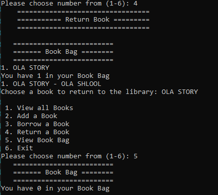

# Lab08-Collections
Create and utilize generic collections. Created a library! Users are given multiple choices of ways to 
interact with the library. This meant creating classes for Books and the Library. 
Collections came into play when a user either adds or removes a book from their book bag. 
Users are also able to create new books, and view all the books within the library and the books in their bags!

### How do you run the program?
1. Clone repo to your device.
2. Open the solution file Phil’s-Lending-Library.sln in Visual Studio.
3. To run the app, go to Debug > Start Without Debugging (or press ctrl+F5).

#### Visuals:
1. #### USERINTERFACE
  

2. #### View all Books

3. #### Add a Book

4. #### Borrow a book

5. #### Return a book

6. #### View Book Bag

